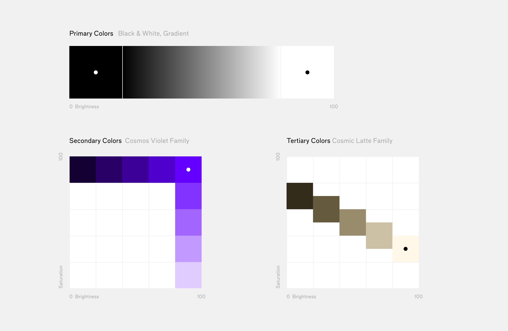

# Cosmos Brand Guide
## 1. Overview

The Cosmos network is the collection of communities that share the vision of sovereign interoperability. As the pioneer of the internet of blockchains, Cosmos network is grounded in technology yet motivated by the shared economic, social, ecological and political values of its communities.

The Cosmos brand consists of visual tools for communicating the technology and the value of the ecosystem. With aspirations to engage and inform with clarity and consistency, we discuss our technology unambiguously with crisp language, and our values succinctly with passion. Every communication is an invitation to the Cosmos community, and an opportunity for us to evolve and expand.

#### Special considerations
This is the most up-to-date guideline of the Cosmos brand. The new visual direction of the brand is outlined below, which aims to solidify and extend the original visual assets. If you’re arriving at this document to create your own brand _in a relationship_ to the Cosmos brand, please see [here](#colors-for-related-brands).

#### Trademark policy
The Interchain Foundation (ICF) is a Swiss non-profit foundation that was formed to support the development of Cosmos and the ecosystem that will contribute to the Cosmos Network. Trademark Policy and Guidelines of Interchain Foundation, Baarermattstrasse 6. 6340 Baar, Switzerland, and/or its affiliates (collectively "ICF") on the use of ICF's trademarks can be found here: https://interchain.io/trademark

#### Contact
[TKTK NAME]
[TKTK TITLE]
[TKTK EMAIL]

## 2. Logos
### 2.1. Cosmos logotype
The Cosmos logotype is the first and the most important visual element of the brand. It represents the entire ecosystem as a whole. With a “slash” in the first O, representing the Earth's axial tilt at 23.4°, the logotype is our primary vehicle to visually distinguish the brand from cosmos (the common noun) or the Cosmos (the observable universe).

The logotype can be displayed in Cosmos Primary Colors (Black & White), or Secondary Colors (Cosmos Violet Family). Further details on colors can be found in [3. Color](#3-color).

[Download files (svg, png, eps)](downloads/cosmos-logotype)

### 2.2. Cosmos Hub logotype
The communities in the Cosmos ecosystem are connected via the Cosmos Hub, a voluntary association of blockchains. The Cosmos Hub logotype appends the circled word “HUB” to the Cosmos logotype, emphasizing the union of communities. Since the Cosmos Hub logotype contains the Cosmos logotype, using both on the same designed surface is redundant and should be avoided.

The logotype can be displayed in Cosmos Primary Colors (Black & White), or Secondary Colors (Cosmos Violet Family). Further details on colors can be found in [3. Color](#3-color).

[Download files (svg, png, eps)](downloads/cosmos-hub-logotype)

### 2.3. Currency symbol for ATOM
The ATOM is the Cosmos Hub’s primary token. Referencing the O with the axial tilt, the currency symbol for ATOM is ‘Ø’ (Unicode `U+00D8`). The symbol is an appropriation of a vowel from northern European languages, for versatility and ease-of-use.

The symbol can be typed by pressing `Option + Shift + O` on a Mac; press and hold `Alt + 0216` from numpad on Windows; and `Ctrl + /` then `Shift + O` on Microsoft Word.

Since the character is borrowed, unlike the dollar sign or the euro sign which have dedicated spaces in Unicode for their specific purpose, it takes special attention when using the letter ‘Ø’ for our purposes to make sure there’s no confusion in understanding.

It is also important to note that the symbol is always uppercase and not ‘ø’ (`U+00F8`), the lowercase character of the same vowel. There are several other symbol characters often used in computing and mathematics that are visually similar, but using them should be strictly prohibited. These include the Empty set/Null sign, ∅ (`U+2205`), or Diameter sign, ⌀ (`U+2300`).

### 2.4. Cosmos Badge
The Cosmos badge is designed to be used as icons in various contexts, market databases and social media channels to represent the Cosmos and Cosmos Hub.

[Download files (svg, png](downloads/cosmos-badge)

The badge is provided in multiple sizes. Whenever possible, use the images without rescaling. The graphic might be specifically adjusted to the particular size to compensate for its smaller size. If there’s no exact size available, use the image one size bigger to scale it down.

### 2.5. Usage
Consider these important points when using the logo across a wide range of applications. Careful use and consideration are a requirement to maintain the integrity of the logo in any type of environment or experience. The logo shouldn’t be altered in any way and should always adhere to this usage guidance.

This usage guideline is to help maintain the visual integrity of Cosmos visual assets. The logotype and badge are integral parts of our brand communication. Careful use and consideration is required to

#### Scale & Alignment
The Cosmos logotype and Cosmos Hub logotype should always maintain its aspect ratio when scaling up or down.

When aligning with other visual elements on the same designed surface, it is best to use the cap height or the baseline as basis for alignment, rather than the ends of the “slash” or the “circle”.

#### Colors

The Cosmos logos should always be displayed in the brand’s primary color (a shade of black) or secondary color (a shade of Cosmos Violet) spectrum. See [3. Color](#3-color) for details.

## 3. Color

The color system of the Cosmos brand consists of three spaces of colors: [Primary](#31-primary-colors), [Secondary](#32-secondary-colors), and [Tertiary](#33-tertiary-colors). Primary colors consists of black & white. Secondary and Tertiary colors expands from a single 'seed' color, resulting in a family of related colors. The Primary colors can be rendered as a gradient but Secondary and tertiary colors are designed to be always used flat.

[Download palette (svg, eps, ase)](downloads/cosmos-colors)

### 3.1. Primary colors
The primary colors define the most important set of colors of the brand: black and white. Unless there is a compelling reason, the Cosmos logos should always be rendered in these colors. The black and white can be rendered flat or as gradient.

#### Black & white
The contrast built in black and white embodies the clarity of the Cosmos brand. The primary colors for the Cosmos starts from the pure black `HSB (0, 0, 0)` to the pure white `HSB (0, 0, 100)`. Any color inside the spectrum can be used to meet the needs of applications. However, it is best practice to use pure black and white by default, unless there’s a specific need to use shades of gray.

|                                              | Name              | HSB           | RGB           | Hex     |
| -------------------------------------------- | ----------------- | ------------- | ------------- | ------- |
|  | **Black**             | `0, 0, 0 `      | `0, 0, 0`       | `#000000` |
|  | **White**             | `0, 0, 100 `    | `255, 255, 255` | `#FFFFFF` |

#### Gradient
When appropriate, the black & white can be rendered as a gradient. The gradient can be of the full spectrum – from brightness `0` to `100` – or partial. However, be always mindful with the use of gradients. Misuse may lead to an overly superficial look that is against the brand’s intended tone of communication.

### 3.2. Secondary colors
The secondary colors are meant to complement the dominant black & white of the primary colors. Used optionally as accents in designs, these secondary colors can provide further specificity and recognizability to the brand. [The Cosmos logos](#2-logos) can be rendered using these colors when appropriate. The secondary colors should only be used as flat colors and not gradients.

#### Cosmos Violet
The secondary colors stem from violet, representing the most vibrant wavelength in the visual color spectrum. The Cosmos Violet is specifically defined as 23.4° (the Earth’s axial tilt) shift in hue from pure blue, in HSB color space.

#### Cosmos Violet family
The full family of colors is defined as the full spectrum of saturation (`S` in HSB, `0` to `100`) in one way and brightness (`B` in HSB, `0` to `100`) in the other way, of the Cosmos Violet.

Even though the below example only shows the spectrum in intervals of `10`, any color in between can be used to meet the needs of applications. However, it is best practice to default to pure Cosmos Violet whenever possible.

|                                              | Name              | HSB           | RGB           | Hex     |
| -------------------------------------------- | ----------------- | ------------- | ------------- | ------- |
|  | Cosmos Violet +90 | `263, 10, 100`  | `239, 229, 255` | `#EFE5FF` |
|  | Cosmos Violet +80 | `263, 20, 100`  | `224, 204, 255` | `#E0CCFF` |
|  | Cosmos Violet +70 | `263, 30, 100`  | `208, 178, 255` | `#D0B2FF` |
|  | Cosmos Violet +60 | `263, 40, 100`  | `193, 153, 255` | `#C199FF` |
|  | Cosmos Violet +50 | `263, 50, 100`  | `177, 128, 255` | `#B180FF` |
|  | Cosmos Violet +40 | `263, 60, 100`  | `162, 102, 255` | `#A266FF` |
|  | Cosmos Violet +30 | `263, 70, 100`  | `146, 77, 255 ` | `#924DFF` |
|  | Cosmos Violet +20 | `263, 80, 100`  | `131, 51, 255 ` | `#8333FF` |
|  | Cosmos Violet +10 | `263, 90, 100`  | `115, 26, 255 ` | `#731AFF` |
|  | **Cosmos Violet (seed)**     | `263, 100, 100` | `99, 0, 255`    | `#6300FF` |
|  | Cosmos Violet -10 | `263, 100, 90`  | `90, 0, 229   ` | `#5A00E5` |
|  | Cosmos Violet -20 | `263, 100, 80`  | `80, 0, 204   ` | `#5000CC` |
|  | Cosmos Violet -30 | `263, 100, 70`  | `70, 0, 178   ` | `#4600B2` |
|  | Cosmos Violet -40 | `263, 100, 60`  | `60, 0, 153   ` | `#3C0099` |
|  | Cosmos Violet -50 | `263, 100, 50`  | `50, 0, 128   ` | `#320080` |
|  | Cosmos Violet -60 | `263, 100, 40`  | `40, 0, 102   ` | `#280066` |
|  | Cosmos Violet -70 | `263, 100, 30`  | `30, 0, 77    ` | `#1E004D` |
|  | Cosmos Violet -80 | `263, 100, 20`  | `20, 0, 51    ` | `#140033` |
|  | Cosmos Violet -90 | `263, 100,10 `  | `10, 0, 26    ` | `#0A001A` |

### 3.3. Tertiary colors
The tertiary colors are chosen to optionally accompany the other two color sets to add subtleties to the applications. These colors should not be used as gradients, and also not to be used to render Cosmos logos.

#### Cosmic Latte
The tertiary color spectrum expands from the color called Cosmic latte, the average color of the universe found by a team of astronomers in 2002.

#### Cosmic Latte family
The full family of colors is defined as the band of colors from `HSB (42, 9, 100)` to `HSB (42, 59, 0)`, where the ratio between the incremental saturation (`S`) and decremental brightness (`B`) is 1:2.

|                                              | Name              | HSB           | RGB           | Hex     |
| -------------------------------------------- | ----------------- | ------------- | ------------- | ------- |
|  | **Cosmic Latte**      | `42, 9, 100`    | `255, 248, 232` | `#FFF8E8` |
|  | Cosmic Latte -10  | `42, 14, 90`    | `229, 219, 197` | `#E5DBC5` |
|  | Cosmic Latte -20  | `42, 19, 80`    | `204, 192, 165` | `#CCC0A5` |
|  | Cosmic Latte -30  | `42, 24, 70`    | `178, 166, 136` | `#B2A688` |
|  | Cosmic Latte -40  | `42, 29, 60`    | `153, 140, 109` | `#998C6D` |
|  | Cosmic Latte -50  | `42, 34, 50`    | `128, 115, 84 ` | `#807354` |
|  | Cosmic Latte -60  | `42, 39, 40`    | `102, 90, 62  ` | `#665A3E` |
|  | Cosmic Latte -70  | `42, 44, 30`    | `77, 67, 43   ` | `#4D432B` |
|  | Cosmic Latte -80  | `42, 49, 20`    | `51, 44, 26   ` | `#332C1A` |
|  | Cosmic Latte -90  | `42, 54, 10`    | `25, 21, 11   ` | `#19150B` |

### 3.4. Usage
The primary, secondary, and tertiary family provide a broad range of colors to choose from. Whenever possible, the designer should use the ‘seed’ colors – the black, the Cosmos Violet, and the Cosmic Latte – as the starting point.

#### Contrast
One of the key considerations when choosing colors is to create enough contrast between two elements. It is always important to create enough contrast around Cosmos logos and around important texts. Especially for web use, [The Web Content Accessibility Guidelines](https://www.w3.org/WAI/standards-guidelines/wcag/) (WCAG) details what specific ratios can achieve minimal legibility.

#### Colors for ‘related’ brands
Cosmos ecosystem is an association of distinct communities with shared values. The landscape often necessitates a constituent community to create a brand in relation to the Cosmos brand. A good example would be when your project is using Interchain Security, or when you’re building a front-end interface for the Cosmos Hub. We find these voluntary associations to our brand to be valuable assets for our ecosystem.

One popular strategy of creating a brand in relation to another is to reference and appropriate certain aspects of the other brand, visual or conceptual. In our case, we feel that the best place to reference would be our color system. Since it allows a wide assortment of colors, it can be used to create a fresh set of colors that is distinct from the official Cosmos brand but still feels related.

#### Application samples

[Download Sample 1 (fig)](#)

[Download Sample 2 (fig)](#)

[Download Sample 3 (eps)](#)

## 4. Typography
### 4.1. Primary typeface
#### HB Margin
The Cosmos brand relies on HB Margin (beta), a contemporary sans-serif with sharp geometry combined with careful humanistic adjustments. For general typesetting purposes, it is recommended to use HB Margin L, a variant in the typeface family with the longest x-height. To access the typeface, please contact [TKTK NAME], [TKTK TITLE], [TKTK EMAIL].

As a general rule, the typesetting should always default to using Regular weight, and use other weights sparingly for emphasis. When creating emphasis, it is also recommended to use only one visual indication – bold, italic, underline, all caps, etc – and not multiple, for crispness and to minimize redundancy.

#### HB Margin features
A useful feature of HB Margin is tabular figures, which can be turned on using OpenType features. The typeface also includes a few stylistic sets – SS01, SS02, and SS03 – which provide alternate letterforms for the characters ‘a’, ‘R’, and ‘Q’.

### 4.2. Monospace typeface

#### Liberation Mono
Recommended monospaced typeface for typesetting code is Liberation Mono. The font is licensed under the SIL Open Font License, anc can be obtained from https://github.com/liberationfonts/liberation-fonts.

### 4.3. Writing styles
#### Cosmos and Cosmos Hub
Even though the Cosmos logotype shows the word in all caps, as a basic rule, the word should always be capitalized as ‘Cosmos’ inside paragraphs. Similarly, ‘Cosmos Hub’ is always capitalized as shown, not ‘Cosmos HUB’ or ‘Cosmos hub.‘ The only exception to this rule is when Cosmos is shown by itself – not in paragraphs, not in headings, etc – which is when it can be written in all caps. However if this is the case, there’s a good chance it should be replaced with the Cosmos logotype instead.

#### ATOM
In contrast, ATOM should be written in all caps, following the convention of ticker symbols. One exception is when ATOM is written in code, in which case it is better to follow the convention of the given programming context. ATOM is also never written as ATØM.

The currency symbol for ATOM is Ø (Unicode `U+00D8`) and not ∅ (`U+2205`), or ⌀ (`U+2300`). Micro-ATOM can be written as µATOM or µØ.

### 5. Appendix
#### Useful resources
- [WCAG](https://www.w3.org/WAI/standards-guidelines/wcag/)
- [SIL Open Font License](https://scripts.sil.org/cms/scripts/page.php?site_id=nrsi&id=OFL)
- [Trademark Policy](https://interchain.io/trademark)
